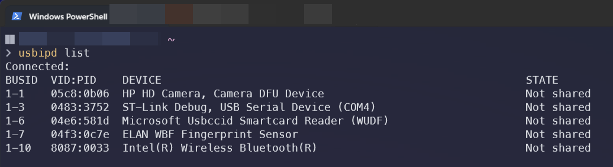
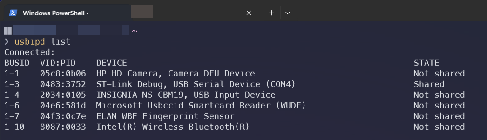
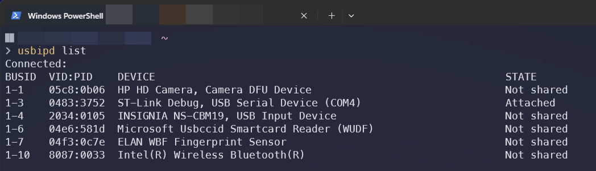
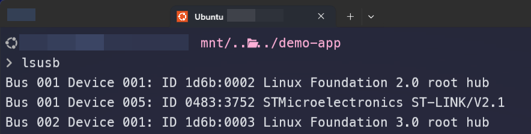

# Docker Demo Application Example

## Prerequesites

| Tools | Description | Environment |
| --- | --- | --- |
| **[USB/IP](https://github.com/dorssel/usbipd-win/releases/latest)** (usbipd) | This connects USB devices into WSL (Win11). Latest version is good to use. | host |
| **usbutils** | provides commands such as `lsusb` (WSL). | host (WSL) |
| **openocd** | debugging client | host (WSL) |
| **gdb-multiarch** | debugging server | host (WSL)  |
| **docker** | Install docker desktop | host |

## Guides

### Building Docker image
At the root of the project folder: 

```docker 
docker build -t docker-demo .
```

### Running Docker image

Again, at the root of the project folder:

```docker 
docker run -it --rm --privileged -v "$PWD":/workspace docker-demo
```

> **NOTE**: You may add `--hostname <name you want>` to distinguish container vs. host.

> **NOTE**: To exit out of the container, `Ctrl+D`.

### Connecting microcontroller into WSL

1) Install USB/IP (usbipd), may require admins rights.
2) Once installed, run `usbipd list` in PowerShell.

    

3) Run `usbipd bind --busid <BUS ID>` to allow the device to be shared with WSL, may require admin rights.

    For example, using the ID in the previous image:
    > usbipd bind --busid 1-3

    Then executing `usbipd list`,

    

4) Run `usbipd attach --wsl --busid <BUS ID>` to attach the USB device to WSL.

    

    **NOTE**: Sometimes the binding fails when attaching the USB device, if this happends, `usbipd bind --force --busid <BUS ID>` must be used.

5) In WSL, run `lsusb` to find the USB device.

    
